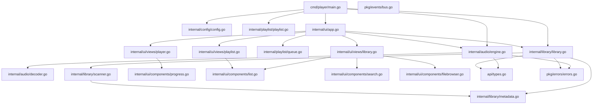

# Application Flow - Golang Music Player

A complete walkthrough of how the application executes, tracing every function call across files.

---

## Architecture Overview



---

## 1. Entry Point — `cmd/player/main.go`

The application starts at [`main()`](file:///mnt/data/college/projects/golang_music_player/cmd/player/main.go#L18-L23), which simply calls `run()` and exits with an error message if it fails.

### `run()` — The bootstrap function (Line 25–91)

This is where all initialization happens, in this order:

#### Step 1: Load Configuration
```go
configPath := config.GetConfigPath()      // → internal/config/config.go
cfg, err := config.LoadOrCreate(configPath) // → internal/config/config.go
```
- [`config.GetConfigPath()`](file:///mnt/data/college/projects/golang_music_player/internal/config/config.go#L118-L137) checks `MUSIC_PLAYER_CONFIG` env var → `XDG_CONFIG_HOME` → falls back to `~/.config/musicplayer/config.json`
- [`config.LoadOrCreate()`](file:///mnt/data/college/projects/golang_music_player/internal/config/config.go#L101-L116) tries to load the config with `LoadConfig()`. If the file doesn't exist, it creates one with `GetDefaultConfig()` and saves it via `SaveConfig()`

#### Step 2: Create Data Directory
```go
os.MkdirAll(cfg.DataDir, 0755)
```

#### Step 3: Setup Graceful Shutdown
Creates a cancellable `context.Context` and listens for `SIGINT`/`SIGTERM` signals in a goroutine to trigger `cancel()`.

#### Step 4: Initialize Audio Engine
```go
audioEngine := audio.NewAudioEngine()  // → internal/audio/engine.go
audioEngine.Start(ctx)                 // → internal/audio/engine.go
```
- [`audio.NewAudioEngine()`](file:///mnt/data/college/projects/golang_music_player/internal/audio/engine.go#L31-L42) creates the engine with default state (stopped, volume 0.5, no repeat), and buffered channels for commands (10) and events (20)
- [`audioEngine.Start(ctx)`](file:///mnt/data/college/projects/golang_music_player/internal/audio/engine.go#L44-L47) launches **two goroutines**:
  - `go e.run(ctx)` — the **command loop** that processes play/pause/stop/seek/volume commands
  - `go e.trackPosition(ctx)` — ticks every 500ms to update the current playback position

#### Step 5: Load Library
```go
libraryPath := filepath.Join(cfg.DataDir, "library.json")
lib, err := library.LoadLibrary(libraryPath)  // → internal/library/library.go
```
- [`library.LoadLibrary()`](file:///mnt/data/college/projects/golang_music_player/internal/library/library.go#L291-L313) reads `library.json`, unmarshals the tracks, and calls `rebuildIndices()` to populate artist/album indices

#### Step 6: Scan for Music (if library is empty)
```go
if lib.TotalTracks == 0 && len(cfg.MusicDirectories) > 0 {
    lib.Scan(ctx, cfg.MusicDirectories)  // → internal/library/library.go
}
```
- [`lib.Scan()`](file:///mnt/data/college/projects/golang_music_player/internal/library/library.go#L233-L256) creates a [`Scanner`](file:///mnt/data/college/projects/golang_music_player/internal/library/scanner.go#L15-L19) (4 workers by default)
- The scanner's [`Scan()`](file:///mnt/data/college/projects/golang_music_player/internal/library/scanner.go#L49-L139) method:
  1. Launches a **file discovery goroutine** that walks directories with `filepath.WalkDir`, filtering for `.mp3`, `.wav`, `.flac` files
  2. Launches a **worker pool** (4 goroutines) that read files from the channel and call [`MetadataReader.Read()`](file:///mnt/data/college/projects/golang_music_player/internal/library/metadata.go#L22-L65)
  3. `MetadataReader.Read()` opens files, generates an MD5-based track ID, reads ID3/metadata tags via `github.com/dhowden/tag`, and returns an `api.Track`
  4. Back in `lib.Scan()`, each discovered track is added via [`lib.AddTrack()`](file:///mnt/data/college/projects/golang_music_player/internal/library/library.go#L45-L63), which updates the tracks map and artist/album indices

#### Step 7: Defer Library Save
```go
defer func() {
    lib.Save(libraryPath)  // → internal/library/library.go
}()
```
[`lib.Save()`](file:///mnt/data/college/projects/golang_music_player/internal/library/library.go#L270-L289) marshals the library to JSON and writes it to `library.json`

#### Step 8: Initialize Playlist Manager
```go
playlistPath := filepath.Join(cfg.DataDir, "playlists")
plManager := playlist.NewManager(playlistPath)  // → internal/playlist/playlist.go
plManager.LoadAll()                              // → internal/playlist/playlist.go
```
- [`playlist.NewManager()`](file:///mnt/data/college/projects/golang_music_player/internal/playlist/playlist.go#L22-L28) creates a manager with an in-memory map
- [`plManager.LoadAll()`](file:///mnt/data/college/projects/golang_music_player/internal/playlist/playlist.go#L179-L213) reads all `.json` files from the playlists directory and loads them into memory

#### Step 9: Launch the UI
```go
ui.Run(audioEngine, lib, plManager)  // → internal/ui/app.go
```

---

## 2. UI Initialization — `internal/ui/app.go`

### `ui.Run()` (Line 409–415)
```go
func Run(engine, lib, plManager) error {
    model := NewModel(engine, lib, plManager)
    p := tea.NewProgram(model, tea.WithAltScreen(), tea.WithMouseCellMotion())
    _, err := p.Run()
    return err
}
```
Creates the Bubble Tea program with alt-screen and mouse support.

### [`NewModel()`](file:///mnt/data/college/projects/golang_music_player/internal/ui/app.go#L65-L105)

Creates the main `Model` struct and initializes:
1. **Sub-views** — by calling constructors in `internal/ui/views/`:
   - [`views.NewPlayerView()`](file:///mnt/data/college/projects/golang_music_player/internal/ui/views/player.go#L30-L56) → creates a [`components.NewProgressBar()`](file:///mnt/data/college/projects/golang_music_player/internal/ui/components/progress.go#L30-L42)
   - [`views.NewLibraryView()`](file:///mnt/data/college/projects/golang_music_player/internal/ui/views/library.go#L31-L51) → creates a [`components.NewTrackList()`](file:///mnt/data/college/projects/golang_music_player/internal/ui/components/list.go#L26-L47), [`components.NewSearchInput()`](file:///mnt/data/college/projects/golang_music_player/internal/ui/components/search.go#L20-L35), and [`components.NewFileBrowser()`](file:///mnt/data/college/projects/golang_music_player/internal/ui/components/filebrowser.go#L39-L75)
   - [`views.NewPlaylistView()`](file:///mnt/data/college/projects/golang_music_player/internal/ui/views/playlist.go#L25-L44) → creates a `components.NewTrackList()`
2. **Playback queue** — [`playlist.NewQueue()`](file:///mnt/data/college/projects/golang_music_player/internal/playlist/queue.go#L21-L29)
3. **Data binding** — loads library tracks into the view with `lib.GetAllTracks()` → `libraryView.SetTracks()`, and loads playlists with `plManager.GetAll()` → `playlistView.SetPlaylists()`
4. The **default view** is set to `ViewLibrary`

### [`Init()`](file:///mnt/data/college/projects/golang_music_player/internal/ui/app.go#L107-L113)

Starts two async loops:
- **`tickCmd()`** — sends a `TickMsg` every 500ms to refresh the UI
- **`listenForEvents()`** — listens on `audioEngine.Events()` channel for playback events

---

## 3. Main Event Loop — `Model.Update()`

[`Update()`](file:///mnt/data/college/projects/golang_music_player/internal/ui/app.go#L144-L348) is the heart of the application. It handles all messages:

### Window Resize (`tea.WindowSizeMsg`)
Updates dimensions and calls `updateViewSizes()` to resize all sub-views.

### Timer Tick (`TickMsg`)
- Calls `audioEngine.GetState()` → [`engine.go`](file:///mnt/data/college/projects/golang_music_player/internal/audio/engine.go#L266-L276)
- Updates the player view with `playerView.SetState()` → [`player.go`](file:///mnt/data/college/projects/golang_music_player/internal/ui/views/player.go#L58-L64), which also calls `ProgressBar.SetProgress()`
- Schedules the next tick

### Audio State Update (`StateUpdateMsg`)
- Updates player view state
- Re-subscribes to audio events via `listenForEvents()`
- On `EventTrackEnded`: auto-advances by calling `queue.Next()` → [`queue.go`](file:///mnt/data/college/projects/golang_music_player/internal/playlist/queue.go#L70-L94), then `audioEngine.Play(next)`

### File Added (`views.FileAddedMsg`)
- Calls `library.AddFile(path)` → [`library.go`](file:///mnt/data/college/projects/golang_music_player/internal/library/library.go#L336-L344), which uses `Scanner.ScanFile()` → `MetadataReader.Read()`
- Updates the library view with `libraryView.AddTrack()`

### Keyboard Input (`tea.KeyMsg`)

**Search/Browse interception** — If the library view is in search or browse mode, all keys (except `ctrl+c`) are forwarded to `libraryView.Update()` → [`library.go view`](file:///mnt/data/college/projects/golang_music_player/internal/ui/views/library.go#L65-L129)

**Global keybindings** (when not searching):

| Key | Action | Calls |
|-----|--------|-------|
| `q` / `ctrl+c` | Quit | `cancel()` + `tea.Quit` |
| `1` / `2` / `3` | Switch view | Sets `activeView` |
| `Tab` | Cycle views | `activeView = (activeView + 1) % 3` |
| `Space` | Play/Pause toggle | `audioEngine.Pause()` / `Resume()` / `Play()` → [`engine.go`](file:///mnt/data/college/projects/golang_music_player/internal/audio/engine.go#L231-L246) |
| `s` | Stop | `audioEngine.Stop()` → [`engine.go`](file:///mnt/data/college/projects/golang_music_player/internal/audio/engine.go#L248-L251) |
| `n` | Next track | `queue.Next()` → `audioEngine.Play()` |
| `p` | Previous track | `queue.Previous()` → `audioEngine.Play()` |
| `→` | Seek forward 5s | `audioEngine.Seek(pos + 5s)` → [`engine.go`](file:///mnt/data/college/projects/golang_music_player/internal/audio/engine.go#L253-L256) |
| `←` | Seek backward 5s | `audioEngine.Seek(pos - 5s)` |
| `+` / `=` | Volume up 10% | `audioEngine.SetVolume()` → [`engine.go`](file:///mnt/data/college/projects/golang_music_player/internal/audio/engine.go#L258-L264) |
| `-` | Volume down 10% | `audioEngine.SetVolume()` |
| `r` | Cycle repeat mode | `queue.SetRepeatMode()` → [`queue.go`](file:///mnt/data/college/projects/golang_music_player/internal/playlist/queue.go#L216-L221) |
| `S` | Toggle shuffle | `queue.Shuffle()` / `Unshuffle()` → [`queue.go`](file:///mnt/data/college/projects/golang_music_player/internal/playlist/queue.go#L156-L214) |
| `Enter` | Play selected | See below |
| Other keys | Forward to active view | `libraryView.Update()` / `playlistView.Update()` |

**Enter key flow:**
1. Gets the selected track from the active view (`libraryView.SelectedTrack()` or `playlistView.SelectedTrack()`)
2. Loads all tracks into the queue with `queue.Set(tracks)`
3. Jumps to the selected track with `queue.JumpTo(i)`
4. Calls `audioEngine.Play(track)`

### Mouse Click (`tea.MouseMsg`)
- Checks if the click is on the progress bar row
- Calls `playerView.ProgressBarClickSeek()` → [`player.go`](file:///mnt/data/college/projects/golang_music_player/internal/ui/views/player.go#L79-L83) → `ProgressBar.HandleClick()` → [`progress.go`](file:///mnt/data/college/projects/golang_music_player/internal/ui/components/progress.go#L60-L76)
- Sends a seek command via `audioEngine.Seek()`

---

## 4. Audio Playback — `internal/audio/engine.go`

### Command Processing — `run()` (Line 53–112)

The `run()` goroutine processes commands from the `commands` channel:

| Command | Action |
|---------|--------|
| `CmdPlay` | Calls [`playTrack()`](file:///mnt/data/college/projects/golang_music_player/internal/audio/engine.go#L145-L185): stops current playback → opens file → calls [`DecodeAudio()`](file:///mnt/data/college/projects/golang_music_player/internal/audio/decoder.go#L32-L46) → creates `beep.Ctrl` + `effects.Volume` → initializes speaker → starts playback with `speaker.Play()` |
| `CmdPause` | Sets `ctrl.Paused = true`, status → `StatusPaused` |
| `CmdResume` | Sets `ctrl.Paused = false`, status → `StatusPlaying` |
| `CmdStop` | Calls [`stopPlayback()`](file:///mnt/data/college/projects/golang_music_player/internal/audio/engine.go#L187-L204): clears speaker → closes streamer → resets state |
| `CmdVolume` | Adjusts `volume.Volume` using a linear-to-dB scale |
| `CmdSeek` | Calls [`seekTo()`](file:///mnt/data/college/projects/golang_music_player/internal/audio/engine.go#L206-L224): converts duration to sample position → `streamer.Seek()` |

### Audio Decoding — `internal/audio/decoder.go`

[`DecodeAudio()`](file:///mnt/data/college/projects/golang_music_player/internal/audio/decoder.go#L32-L46) routes to the correct decoder based on file extension:
- `.mp3` → `beep/mp3.Decode()`
- `.wav` → `beep/wav.Decode()`
- `.flac` → `beep/flac.Decode()`

### Position Tracking — `trackPosition()` (Line 114–143)

Every 500ms, reads the current sample position from the streamer and emits an `EventPositionUpdate` event, which triggers a UI refresh via `listenForEvents()`.

---

## 5. View Rendering — `Model.View()`

[`View()`](file:///mnt/data/college/projects/golang_music_player/internal/ui/app.go#L360-L391) renders the UI:

1. **Tab bar** — `renderTabs()` shows `[1] Player | [2] Library | [3] Playlist`
2. **Player view** — always visible (shows track info, progress bar, volume, controls)
3. **Active content view** — one of:
   - **Library view** → search bar + track list + help text
   - **Playlist view** → playlist list or track list + help text
4. **Error display** — shows any error at the bottom

### Library View Modes
- **Normal** — shows track list, `[/]` activates search, `[a]` opens file browser
- **Search mode** — keys go to `SearchInput.Update()` → live filtering via `filterTracks()`
- **Browse mode** — keys go to `FileBrowser.Update()` → navigate filesystem → select file → emits `FileAddedMsg`

---

## 6. Shared Types — `api/types.go`

Defines all shared data structures used across the application:
- `Track` — song metadata (title, artist, album, duration, file path, etc.)
- `Playlist` — named collection of tracks
- `PlaybackState` — current player status, position, volume, queue
- `AudioCommand` / `AudioEvent` — communication between UI and audio engine
- `Player` interface — defines the playback contract that `AudioEngine` implements
- Enums: `PlayerStatus`, `RepeatMode`, `CommandType`, `EventType`

---

## 7. Error Handling — `pkg/errors/errors.go`

Provides:
- **Sentinel errors**: `ErrTrackNotFound`, `ErrPlaylistNotFound`, `ErrInvalidFormat`, `ErrPlaybackFailed`, `ErrEmptyQueue`, `ErrInvalidVolume`
- **`PlayerError`** — wraps errors with operation name and track ID context
- **`ScanError`** — wraps errors with the file path that failed

---

## 8. Event Bus — `pkg/events/bus.go`

A pub/sub system (currently not wired into `main.go` but available):
- `Subscribe(eventType)` — listen for specific event types
- `SubscribeAll()` — listen for all events
- `Publish(event)` — broadcast to subscribers (non-blocking)
- Thread-safe via `sync.RWMutex`

---

## Summary: Complete Call Chain

```
main() → run()
  ├── config.GetConfigPath() → config.LoadOrCreate()
  ├── audio.NewAudioEngine() → audioEngine.Start()
  │     ├── goroutine: run() — command loop
  │     └── goroutine: trackPosition() — position updates
  ├── library.LoadLibrary() → rebuildIndices()
  ├── library.Scan() (if empty)
  │     └── Scanner.Scan()
  │           ├── goroutine: WalkDir (file discovery)
  │           └── goroutines: worker pool → MetadataReader.Read()
  ├── playlist.NewManager() → LoadAll()
  └── ui.Run()
        └── NewModel() → tea.NewProgram().Run()
              ├── Init() → tickCmd() + listenForEvents()
              └── Update() loop:
                    ├── TickMsg → audioEngine.GetState() → playerView.SetState()
                    ├── StateUpdateMsg → playerView.SetState()
                    ├── KeyMsg → audioEngine.Play/Pause/Stop/Seek/Volume
                    │            queue.Next/Previous/Shuffle
                    │            libraryView.Update() / playlistView.Update()
                    ├── MouseMsg → ProgressBar.HandleClick() → audioEngine.Seek()
                    └── FileAddedMsg → library.AddFile() → libraryView.AddTrack()
```
